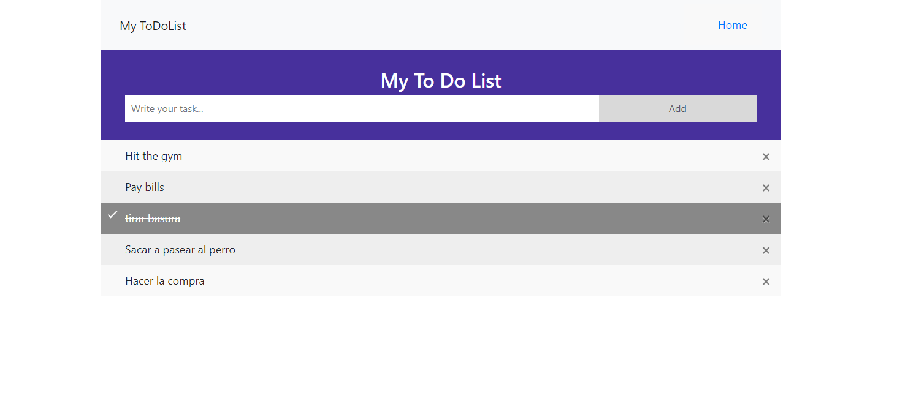

# todolist
***
This code repo contains the code developed for a Go rest API consisting of a simple ToDoList service.

## Table of Contents
1. [General Info](#general-info)
2. [Technologies](#technologies)
3. [Installation](#installation)
### General Info
***
At this time, you have a RESTful API server running at `http://127.0.0.1:8000`. It provides the following endpoints:

* `GET /tasks`: get the list of all tasks
* `POST /tasks`: add a new task
* `PUT /tasks/:id`: mark a task as completed
* `DELETE /tasks/:id`: deletes a task
## Technologies
***
A list of technologies used within the project:
* [Go](https://go.dev): Version 1.18.3
* [Docker](https://www.docker.com)
* [rs/cors](https://github.com/rs/cors)
* [gorilla/mux](https://"github.com/gorilla/mux)
## Installation
***
A little intro about the installation. 
```
$ git clone https://github.com/jorgefg4/todolist.git
$ cd ../cmd/todolist
$ go run main.go
```

*This section is pending an update, and is meant as a guide for future proper redaction*
For the project to launch, you will need Docker installed, and preferably the Make tool too.

Having Make:
 Clone the repository, enter the root folder, then execute "make". To stop the app, execute "make stop".

Not having Make:
 Clone the repository, enter the root folder, then execute "docker build -t todolist ." and "docker run -p 8000:8000 --name todolist todolist". To stop the app, execute "docker stop todolist".
